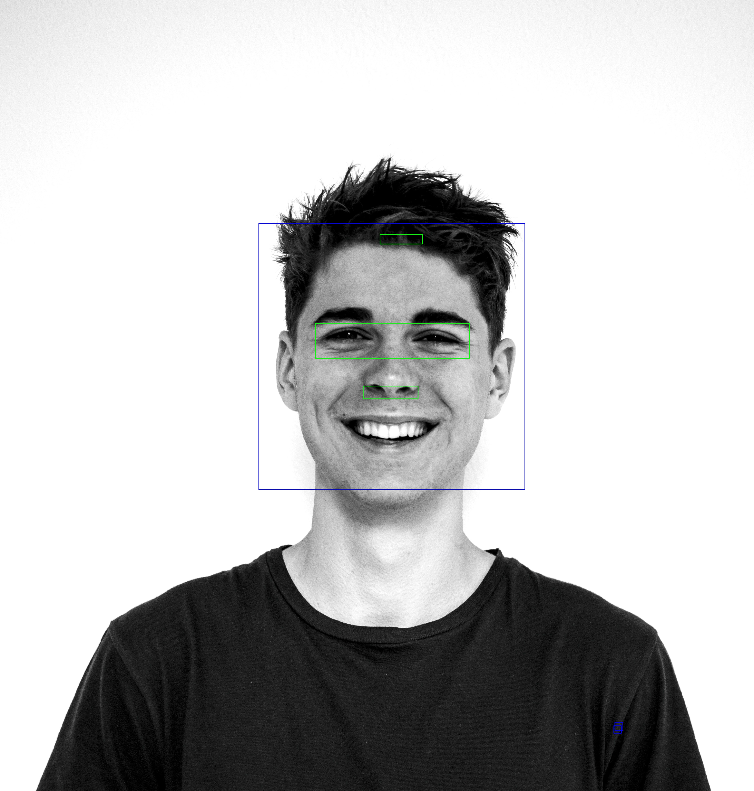

# Face_detection
Face_detection Using Haarcascade

Object Detection using Haar feature-based cascade classifiers is an effective object detection method proposed by Paul Viola and Michael Jones in their paper, "Rapid Object Detection using a Boosted Cascade of Simple Features" in 2001. It is a machine learning based approach where a cascade function is trained from a lot of positive and negative images. It is then used to detect objects in other images.

Here we will work with face detection. Initially, the algorithm needs a lot of positive images (images of faces) and negative images (images without faces) to train the classifier. Then we need to extract features from it. For this, Haar features shown in the below image are used. They are just like our convolutional kernel. Each feature is a single value obtained by subtracting sum of pixels under the white rectangle from sum of pixels under the black rectangle.

haar_features.jpg

Haar features are similar to these convolution kernels which are used to detect the presence of that feature in the given image.
Each feature results in a single value which is calculated by subtracting the sum of pixels under white rectangle from the sum of pixels under black rectangle.

Haar features used in viola Jones Applying on a given image

Different Kernels have different applications and can detect shapes. Choosing a kernel is very important for detection. 

Detecting a nose might need a kernel able to detect horizontal change in pixel values and detecting a mouth can have kernel sensitive to pixel values in the horizontal direction. 

This Kernel can detect changes in the horizontal direction.

There are different type of kernels shown in the picture.

The output Images for Face Detection using Haarcascade and Facial features like eyes. 

The accuracy is good but there are some glitches since we can see the rectangular boxes which are basically used after the detection in the areas where there are no features.
